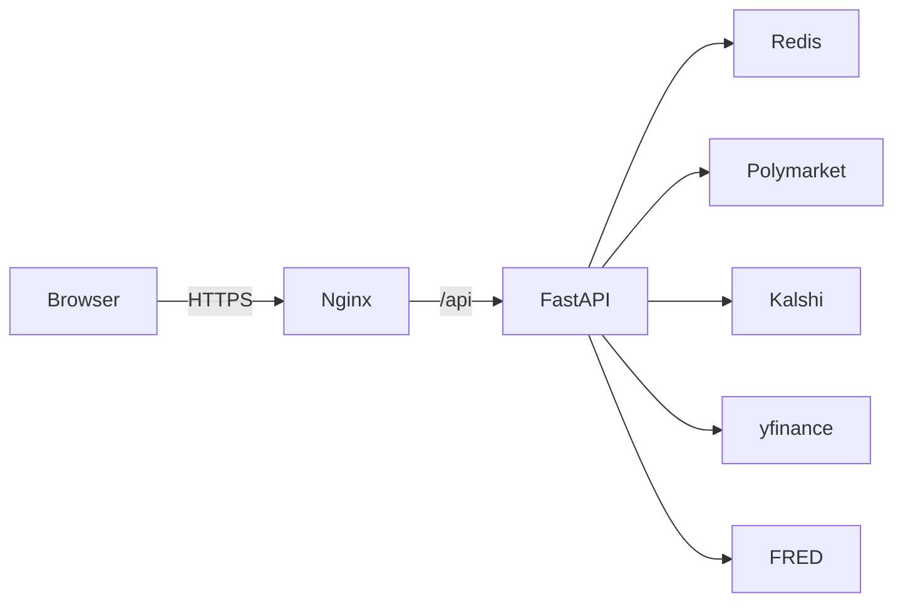

# proyectofuentes — quant prediction-markets hub

> **The Yahoo Finance of prediction markets, plus a quant strategies hub.**

[](https://github.com/{owner}/{repo}/actions/workflows/ci.yml)
[](#)
[](#)
[](#)
[](#)
[](LICENSE)

<!-- CI badge: replace {owner}/{repo} with the actual GitHub path once the repo is public. -->


[](https://fly.io/docs/launch/)
[](https://render.com/deploy)

| Read first | Where it lives |
|---|---|
| Production deploy | [`DEPLOYMENT.md`](DEPLOYMENT.md) |
| Feature walkthrough | [`docs/USER_GUIDE.md`](docs/USER_GUIDE.md) |
| 15-minute demo script | [`docs/DEMO_SCRIPT.md`](docs/DEMO_SCRIPT.md) |
| Documentation index | [`docs/README.md`](docs/README.md) |
| Production checklist | [`docs/PRODUCTION_CHECKLIST.md`](docs/PRODUCTION_CHECKLIST.md) |
| Release history | [`CHANGELOG.md`](CHANGELOG.md) |

## Why this exists

Prediction markets are the cleanest probabilistic forecast around, but the
data tooling is a decade behind equities. This project wraps Polymarket,
Kalshi, FRED and yfinance into a single Bloomberg-style terminal **plus** a
disciplined quant-research workbench so a user can go from "I think the FOMC
contract is mispriced" to a HAC-corrected factor regression and a
backtested strategy in under five minutes.

## Try it locally (60 seconds)

```bash
git clone https://github.com/DGallardoL/predictionterminal
cd predictionterminal
docker-compose up -d
open http://localhost:8080
```

That's it. Press `Cmd+K` to search 1260 markets, or click "Try one of these"
buttons on the landing page. The API is on `http://localhost:8000`,
Swagger at `http://localhost:8000/docs`, OpenAPI JSON at
`http://localhost:8000/openapi.json`.

## Quick demo (3 curls)

```bash
# 1. Healthcheck — confirms API + Redis + git_sha
curl -s http://localhost:8000/health/detail | jq

# 2. List the 1260 factors with metadata
curl -s http://localhost:8000/factors | jq '.factors | length'   # → 1260+

# 3. Reverse Factor Finder — top-5 PM markets explaining NVDA's last 90 days
curl -s -X POST http://localhost:8000/reverse-finder \
  -H 'content-type: application/json' \
  -d '{"ticker": "NVDA", "lookback_days": 90}' | jq '.top_factors[] | {slug, beta, t_stat}'
```

## Feature matrix

| Capability | Free (anon) | Pro (authed) | Quant (authed + key) |
|---|---|---|---|
| Browse 1260 factors | yes | yes | yes |
| Regression mode (`/fit`, `/attribution`) | yes | yes | yes |
| Terminal mode (58+ panels) | yes | yes | yes |
| Cmd-K global search | yes | yes | yes |
| Watchlist (localStorage) | yes | yes | yes |
| Watchlist (server-side, multi-device) | — | yes | yes |
| Reverse Factor Finder | rate-limited | yes | yes |
| Prediction-Driven Alpha Scanner | rate-limited | yes | yes |
| Alert engine (Slack / Discord / Webhook) | — | 5 alerts | unlimited |
| Portfolio Optimizer (HRP / MV / ERC) | — | yes | yes |
| Strategies Hub + tearsheets | summary only | full | full |
| Replay Mode + scenarios | yes | yes | yes |
| Embed widgets (iframe / OG images) | yes | yes | yes |
| Export CSV / JSON / PDF | CSV/JSON | all | all |
| SSE live-stream (30 slugs) | — | yes | yes |
| Prometheus `/metrics` | — | — | yes |
| Auto-Generated Alpha Lab | — | — | yes |
| Cross-venue Arb Scanner | — | yes | yes |

## Modes

**Regression.** Fit `r_{j,t} = α + Σ β_i · Δlogit(p_{i,t}) + ε` for any ticker
against any subset of the 1,228 factors. HAC (heteroskedasticity- and
autocorrelation-consistent) standard errors, automatic bandwidth selection,
configurable clipping ε, VIF reporting. The classical
prediction-factor-model lives here.

**Strategies (α Hub).** Backtested validated alphas with IS/OOS splits,
transaction-cost assumptions, and a deployability verdict. Each strategy
ships with a tearsheet, parameter grid, and a `/health` checker that flags
regime drift. The α Hub is now the default sub-tab inside Terminal mode.

**Terminal.** Bloomberg-style read-only console: order-book depth, trade
tape, resolution calendar, market-cap rankings, correlation heatmaps, news
flow, FRED macro deltas, cross-venue spreads, PM-VIX composite, and 14+
other panels. Plotly via CDN; all rendered from a single HTML page.

## Architecture



```
proyectofuentes/
├── api/
│   └── src/pfm/
│       ├── main.py              # FastAPI app, route registration
│       ├── model.py             # OLS + HAC, automatic bandwidth
│       ├── attribution.py       # per-date β·Δlogit decomposition
│       ├── advanced.py          # embargo walk-forward, BH-FDR
│       ├── multitest.py         # multi-test corrections
│       ├── strategy_verdict.py  # 4-quarter Sharpe stability gate
│       ├── observability.py     # Prometheus /metrics
│       ├── sources/             # polymarket, kalshi, fred, yfinance
│       ├── strategies/          # calendar_lambda, equity_coint, china_taiwan, …
│       └── terminal/            # 58+ read-only endpoints
├── web/
│   ├── index.html               # Plotly via CDN, no build step
│   ├── nginx.conf               # gzip + security headers + rate limit
│   └── data/                    # alpha_strategies.json, live_signals.json
└── tests/                       # 5668+ tests, all external IO mocked
```

**Backend.** FastAPI, Python 3.12, `statsmodels` OLS with `cov_type='HAC'`,
Pydantic v2 schemas, Redis TTL cache (1 h) for upstream pulls. Domain code
in `pfm.model` and `pfm.attribution`; data fetchers isolated under
`pfm.sources/`; strategies under `pfm.strategies/` each export `fit()`,
`signal()`, `tearsheet()`.

**Frontend.** Single `web/index.html`. Plotly loaded from CDN. Tabs for
Regression / Strategies / Terminal with `Cmd+K` global search modal,
deep-linking URL state, and a permanent disclaimer footer. No webpack,
no npm, no React. See [ADR-0009](docs/adrs/0009-frontend-vanilla-html.md)
for the rationale.

## Screenshots

> Screenshots are captured from a live demo deploy. See
> [`docs/screenshots/README.md`](docs/screenshots/README.md) for the capture
> recipe.


## Key endpoints (selected)

Terminal (58 baseline + extensions):

- `GET /terminal/orderbook/{slug}` — top-of-book + depth ladder
- `GET /terminal/tape/{slug}` — recent trades
- `GET /terminal/calendar` — unified resolutions + earnings + macro
- `GET /terminal/movers` — biggest 1d / 7d Δlogit moves with sparklines
- `GET /terminal/heatmap` — correlation matrix across active factors
- `GET /terminal/compare?slugs=a,b,c` — N≤4 side-by-side
- `GET /terminal/live-stream` — SSE multiplex (≤30 slugs)
- `GET /terminal/news`, `/macro`, `/spread/{topic}`, `/volume`, `/liquidity`,
  `/resolved`, `/search`, `/stats`, `/categories`, `/leaders`, `/whales`,
  `/funding`, `/skew`, `/health`

Strategies / regression / quant primitives:

- `POST /fit` — factor regression (HAC, VIF, β, t-stats)
- `POST /attribution` — per-date β·Δlogit decomposition
- `POST /reverse-finder` — ticker → top-5 PM markets explaining return
- `POST /alpha/prediction-driven` — PM slug → equity basket
- `POST /strategies/optimize` — HRP / MV / min-var / risk-parity / ERC
- `POST /quant/multitest/bh` — BH-FDR correction
- `POST /quant/quarterly-stability` — 4-quarter Sharpe stability gate
- `GET  /alpha-hub/graveyard` — public retired-strategy ledger
- `GET  /alpha/decay`, `/alpha/{id}/rolling-sharpe` — auto-demote tracking
- `GET  /factors` — all 1,228 factors with metadata

## Validated alphas (post-wave-5)

Three strategy clusters survived the wave-5 validation pass (cross-validated,
OOS, with realistic transaction costs and slippage):

- **PCA-residual china/taiwan basket — B_VALIDATED.** Walk-forward OOS Sharpe
  4.59 across 6 pairs (n=67 days), drop-top-3 robustness 3.66 with CI95
  [0.02, 7.37]. Recommended weight: 15 %.
- **Calendar λ-ratio — B_VALIDATED with stem cap.** Pooled Sharpe 1.19
  (n=35, 8.5 months). Hard rule: max 3 trades per stem in any 30-day window.
  Weight: 10 %.
- **Bundle arbs — opportunistic only.** Σ(YES asks) < 1 events
  (Eurovision 2026, MLS Cup, Israel-strikes count). Run when surfaced.

See [`docs/alpha-report-v18.md`](docs/alpha-report-v18.md) for the current
verdict and `GET /alpha-hub/graveyard` for the six retired strategies.

## Anti-alphas (failed validation — DO NOT deploy)

Documented so future contributors don't re-discover them. All showed
promising in-sample edges that **collapsed OOS** under realistic costs:
favorites-bias, sparse-trade, fresh-consensus, resolution-rush,
headline-fade, kalshi-arb-naive. Death certificates live under
`docs/graveyard/`.

## Tests

```bash
cd api
PYTHONPATH=src pytest --cov=pfm
```

5668+ tests pass. Coverage ≥ 70 % on `model.py`, `attribution.py`, and each
strategy module. All external IO mocked (`respx` for Polymarket/Kalshi,
fixtures for yfinance and FRED, `NullCache` in place of Redis). Hypothesis
property-based tests on `pfm.model` and `pfm.advanced`. Golden-file
regression on terminal responses. The suite does not hit the network.

## Data sources

- **Polymarket** — `gamma-api.polymarket.com` for markets/metadata,
  `clob.polymarket.com` for `/prices-history` (always `fidelity=1440`,
  see [ADR-0007](docs/adrs/0007-daily-fidelity.md)). `clobTokenIds` ships
  as a JSON-encoded string inside JSON; `json.loads()` it twice.
- **Kalshi** — `trading-api.kalshi.com` for events, markets, order books.
  Used both as a strategy venue and for cross-venue spread monitoring.
- **FRED** — St. Louis Fed series (DGS10, DFF, VIXCLS, T10Y2Y, …) for the
  terminal macro panel and a handful of strategies.
- **yfinance** — daily equity OHLC for the regression mode and the
  equity-coint strategy. UTC-normalized at the `Timestamp.normalize()` level
  to align with Polymarket's unix-second timestamps
  (see [ADR-0006](docs/adrs/0006-timezone-alignment.md)).

## Architecture decisions

The nine ADRs in [`docs/adrs/`](docs/adrs/) are short and load-bearing:

1. [`0001-use-fastapi.md`](docs/adrs/0001-use-fastapi.md)
2. [`0002-logit-transform.md`](docs/adrs/0002-logit-transform.md)
3. [`0003-hac-newey-west.md`](docs/adrs/0003-hac-newey-west.md)
4. [`0004-redis-cache-ttl.md`](docs/adrs/0004-redis-cache-ttl.md)
5. [`0005-no-persistence-poc.md`](docs/adrs/0005-no-persistence-poc.md)
6. [`0006-timezone-alignment.md`](docs/adrs/0006-timezone-alignment.md)
7. [`0007-daily-fidelity.md`](docs/adrs/0007-daily-fidelity.md)
8. [`0008-factor-universe-curation.md`](docs/adrs/0008-factor-universe-curation.md) — why a curated 1260 vs full scrape
9. [`0009-frontend-vanilla-html.md`](docs/adrs/0009-frontend-vanilla-html.md) — why no React/Vue/Svelte

## License

MIT. See [`LICENSE`](LICENSE).

## Contributing

PRs welcome. Run `ruff check .`, `ruff format .`, and `pytest` before
opening. Add a test alongside any change to `model.py`, `attribution.py`,
or `strategies/`. New strategies must include a tearsheet endpoint and an
explicit anti-alpha section if validation fails. **No strategy enters
B_VALIDATED without a 4-quarter stability check** (`POST /quant/quarterly-
stability`).

This is research code, not investment advice. See the disclaimer footer
in the UI.

---

## W11 Refresh — additional reference card

The sections below are appended as part of task **W11-51** to keep the
top-level README aligned with the wave-11 build artefacts. They duplicate
some information from the (older) sections above on purpose; if a number
disagrees, the W11 numbers are authoritative.

### Status badges (shields.io)

[](https://github.com/{owner}/{repo}/actions/workflows/ci.yml)
[](#)
[](#)
[](#)
[](#)
[](#)
[](LICENSE)

> Build badge is a placeholder — wire it to GitHub Actions once the repo
> is public (`actions/workflows/ci.yml`). Coverage is from
> `pytest --cov=pfm` on `model.py`, `attribution.py`, and the
> `strategies/` modules (≥70 % gate enforced in CI).

### Quickstart (`docker-compose up` walkthrough)

```bash
# 1. Clone and enter the repo
git clone https://github.com/youruser/proyectofuentes
cd proyectofuentes

# 2. Spin up FastAPI + Redis + nginx
docker-compose up -d

# 3. Verify the API is alive (expect {"status":"ok",...})
curl -s http://localhost:8000/health | jq

# 4. Open the frontend
open http://localhost:8080
```

If `/health` returns `{"status":"ok"}` the three services (api · redis ·
nginx) are wired correctly. The richer `/health/detail` endpoint also
reports the current git SHA, Redis ping latency, and which upstream APIs
last succeeded.

### Three-mode overview

**Regression mode.** Classical factor-model fits of equity returns on
prediction-market-derived factors:
`r_{j,t} = α + Σ β_i · Δlogit(p_{i,t}) + ε`. Uses `statsmodels` OLS with
HAC standard errors (automatic bandwidth selection), reports VIF, and
supports a configurable clipping ε (default `0.01`) to keep `Δlogit`
finite near the boundaries. Endpoints: `POST /fit`, `POST /attribution`,
`POST /reverse-finder`, `GET /factors`.

**Strategies mode (α Hub).** Curated, validated alphas with IS/OOS
splits, transaction-cost assumptions, and a 4-quarter Sharpe-stability
gate. Each strategy ships with a tearsheet, a parameter grid, and a
decay monitor that auto-flags regime drift. Sub-tabs cover Top Alphas,
Calendar & Spreads, Cross-venue Arb (full Bloomberg-style live monitor
with SSE), and Crypto Micro (Polymarket BTC/ETH 5m & 15m markets vs
GBM-plus-microstructure model).

**Terminal mode.** Bloomberg-style read-only data hub aggregating
order-book depth, trade tape, resolution calendar, jumps + clusters,
correlations, news flow, FRED macro deltas, cross-venue spreads, and
58+ other panels. Plotly via CDN, all rendered from a single HTML page;
the α Hub is the default sub-tab.

### Example curls

```bash
# Count loaded factors (expect 1260+)
curl -s :8000/factors | jq '. | length'

# Fit NVDA against the bitcoin factor, 2024-YTD
curl -s -X POST :8000/fit \
  -H 'content-type: application/json' \
  -d '{"ticker":"NVDA","factors":["bitcoin"],"start":"2024-01-01"}' | jq

# Jump-cluster scan across the active factor universe
curl -s :8000/terminal/jumps/cluster | jq
```

### Architecture (ASCII mini-diagram)

```
                  ┌──────────────────────────────────────────────┐
                  │           Browser (Plotly via CDN)           │
                  └────────────────────┬─────────────────────────┘
                                       │ HTTPS
                  ┌────────────────────▼─────────────────────────┐
                  │            nginx (web/, port 8080)           │
                  │   gzip · security headers · /api proxy       │
                  └────────────────────┬─────────────────────────┘
                                       │
                  ┌────────────────────▼─────────────────────────┐
                  │         FastAPI · uvicorn (port 8000)        │
                  │  routers: regression · factors · strategies  │
                  │           terminal · arb · crypto5min        │
                  └──┬───────────────┬───────────────────────┬───┘
                     │               │                       │
        statsmodels  │   Redis L2    │      httpx pool       │
        (OLS + HAC,  │   TTL cache   │  (keep-alive, retry,  │
         Andrews bw, │   (1h default,│   backoff, mocked in  │
         VIF)        │    stampede   │   tests with respx)   │
                     │    lock)      │                       │
                     │               │           ┌───────────┴───────────┐
                     │               │           ▼                       ▼
                     │               │      Polymarket               Kalshi
                     │               │      (gamma + CLOB)         (trading-api)
                     │               │
                     │               └──────────┬───────────┐
                     │                          ▼           ▼
                     │                       yfinance     GDELT
                     │                      (daily OHLC)  (news)
                     ▼
                statsmodels.OLS(cov_type='HAC', cov_kwds={'maxlags': L})
```

### Documentation index

- [`docs/USER_GUIDE.md`](docs/USER_GUIDE.md) — end-user walkthrough of
  Regression / Strategies / Terminal modes
- [`docs/API_REFERENCE.md`](docs/API_REFERENCE.md) — endpoint reference
  (T44 deliverable)
- [`docs/RUNBOOK.md`](docs/RUNBOOK.md) — operator runbook for the live
  service (W11-49 deliverable)
- [`docs/regression-methodology-improvements.md`](docs/regression-methodology-improvements.md)
  — HAC tuning, embargoed walk-forward, BH-FDR (T79 deliverable)
- [`docs/binary-pricing-results.md`](docs/binary-pricing-results.md) —
  binary-contract pricing backtests and calibration (T83 deliverable)
- [`docs/alpha-report-v18.md`](docs/alpha-report-v18.md) — current
  verdicts on deployable / paper-only / retired strategies (W11-48)
- [`docs/ADRs/`](docs/ADRs/) — architecture decision records (9 + 4
  wave-11 additions on multi-session coordination, cache tiering, arb
  match quality, and the anti-alpha rule)

### Development

```bash
# Tests (no network, ~80 s wall clock)
cd api
PYTHONPATH=src .venv/bin/python -m pytest -q

# Coverage on the load-bearing modules
PYTHONPATH=src .venv/bin/python -m pytest --cov=pfm.model \
                                          --cov=pfm.attribution \
                                          --cov-report=term

# Lint + format
ruff check .
ruff format --check .

# Pre-commit hooks (ruff + ruff-format + trailing-whitespace + EOF-fixer)
pre-commit install
pre-commit run --all-files
```

CI runs the same three jobs (`tests`, `lint`, `pre-commit`) on every
push; coverage on `model.py` / `attribution.py` / `strategies/*` must
stay ≥ 70 % or the build fails.

### License

This project is released under the **MIT License**. See
[`LICENSE`](LICENSE) for the full text. The MIT license permits
commercial use, modification, distribution, and private use; the only
condition is that the copyright notice and license text are included
with substantial portions of the software.

### Acknowledgments

- **Polymarket** and **Kalshi** for free public market data APIs that
  make this project feasible
- **St. Louis Fed (FRED)** for macro series under their open data terms
- **GDELT** for the open news-event stream feeding the terminal news
  panel and the `sentiment:` factor source
- **`statsmodels`** for a battle-tested HAC implementation we did not
  have to roll ourselves
- **`pandas`**, **`numpy`**, **`scipy`** — the bedrock of the quant code
- **FastAPI** + **Pydantic v2** for ergonomic typed APIs
- **Plotly** for charting we did not need a frontend build step for
- **VADER** + the financial-lex overlay in `pfm.terminal.sentiment_nlp`
- Damian's professors and reviewers, whose engineering-discipline
  expectations shaped the test, ADR, and CI structure of this POC

